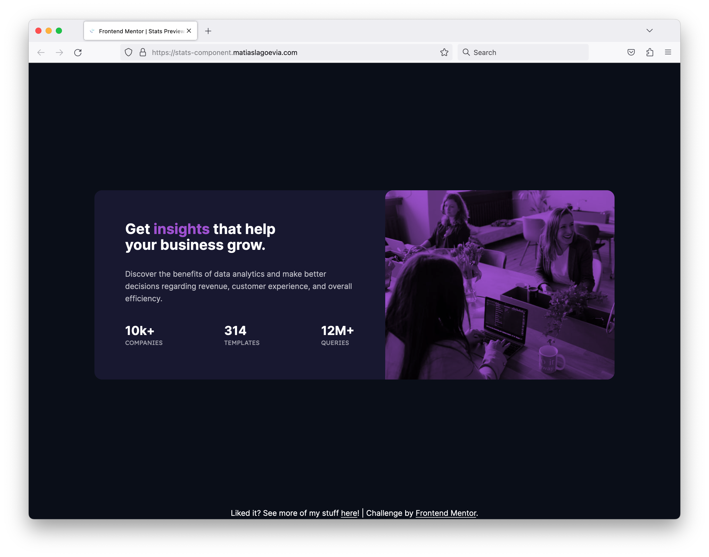

# Frontend Mentor - Stats preview card component solution

This is a solution to the [Stats preview card component challenge on Frontend Mentor](https://www.frontendmentor.io/challenges/stats-preview-card-component-8JqbgoU62). Frontend Mentor challenges help you improve your coding skills by building realistic projects.

## Table of contents

- [Overview](#overview)
  - [The challenge](#the-challenge)
  - [Screenshot](#screenshot)
  - [Links](#links)
- [My process](#my-process)
  - [Built with](#built-with)
  - [What I learned](#what-i-learned)
  - [Continued development](#continued-development)
  - [Useful resources](#useful-resources)
- [Author](#author)
- [Acknowledgments](#acknowledgments)

## Overview

### The challenge

Users should be able to:

- View the optimal layout depending on their device's screen size

### Screenshot

### Links

- [Solution URL](https://www.frontendmentor.io/solutions/responsive-stats-preview-component-using-flexbox-and-bem-9TfTQ7v_yG)
- [Live Site URL](https://stats-component.matiaslagoevia.me)

## My process

### Built with

- Semantic HTML5 markup
- Flexbox
- Mobile-first workflow
- BEM

### What I learned

**HTML Structure & BEM**

I used `@gracesnow`'s tutorial as a reference to help me overcome some hurdles I had.
I then used FigJam (I'd used Excalidraw before) to do some of the thinking and come up with the class names.

**Image skills: `<picture>`, `mix-blend-mode`, `object-fit`**

Grace's tutorial was helpful here as well, and I complemented it with MDN.

### Continued development
I'd like to continue to expand my understanding of BEM & effective HTML structure.
Also, I'd like to continue to get better with images and other types of media.

### Useful resources
- [`@gracesnow`'s tutorial](https://fedmentor.dev/posts/html-plan-product-preview/)
- [BEM 1o1](https://css-tricks.com/bem-101/)
- [`object-fit` reference](https://developer.mozilla.org/en-US/docs/Web/CSS/object-fit)
- [`<picture>` reference](https://developer.mozilla.org/en-US/docs/Web/HTML/Element/picture)
- [`mix-blend-mode` reference](https://developer.mozilla.org/en-US/docs/Web/CSS/mix-blend-mode)

## Author

- Website - [Matias Lago Evia](https://matiaslagoevia.me)
- Frontend Mentor - [@matiaslagoevia](https://www.frontendmentor.io/profile/matiaslagoevia)

